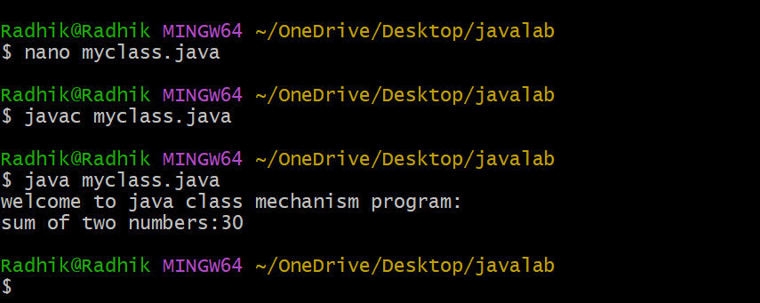

# EXPERIMENT-2a
## Title:myclass
```java

class myclass{
void displayMessage(){
System.out.println("welcome to java class mechanism program:");
}
int add(int a,int b)
{
return a+b;
}
public static void main(String[]args)
{
myclass Obj=new myclass();
Obj.displayMessage();
int result=Obj.add(10,20);
System.out.println("sum of two numbers:"+result);
}
}
```
# output

# EXPERIMENT-2b
## Title:overloadExample
```java


class overloadExample {

    int add(int a, int b) {
        return a + b;
    }

    double add(double a, double b) {
        return a + b;
    }

    int add(int a, int b, int c) {
        return a + b + c;
    }

    public static void main(String[] args) {

        overloadExample obj = new overloadExample();

        System.out.println("Result of adding two integers: " + obj.add(10, 20));
        System.out.println("Result of adding two double values: " + obj.add(5.5, 4.5));
        System.out.println("Result of adding three integers: " + obj.add(1, 2, 3));
    }
}
```
# output
![output of overloadExample]
